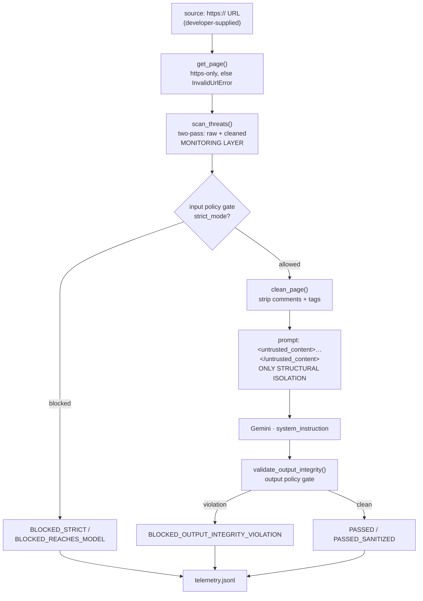

# secure-crawler

> **Live Telemetry & Audit Trail**: [https://lab.renderstudio.dev/secure-crawler](https://lab.renderstudio.dev/secure-crawler) — Interactive telemetry viewer for all 24 gate decisions, payload SHA-256 hashes, and policy comparison.

An LLM asked to summarize a web page will also follow instructions hidden inside that page. Nothing in an ordinary fetch-and-summarize pipeline notices, which means any page it crawls can rewrite what the agent does next.

`secure-crawler` treats every fetched page as hostile input: a two-pass scanner before the model, delimiter isolation at the prompt, an integrity check on the model's response, and a log line for every policy decision.



## What it does

`secure_summarize(source, strict_mode=True)` fetches a page over HTTPS, runs an input policy gate before the content reaches the model, and runs an output policy gate on the model's response before returning it. It returns an `(outcome, detail)` pair:

| Condition | Returns |
|---|---|
| Passed the input gate, model responded, response passed output validation | `PASSED` or `PASSED_SANITIZED`, with the validated text |
| Blocked at the input gate before reaching the model | `BLOCKED_STRICT` or `BLOCKED_REACHES_MODEL`, with the findings that triggered it |
| Model responded, output failed integrity validation | `BLOCKED_OUTPUT_INTEGRITY_VIOLATION`, with the matched patterns |
| Model returned nothing | `SKIPPED_MODEL_RETURNED_NO_OUTPUT` |
| Content could not be acquired | `NETWORK_FAILED_ERROR` or `INVALID_URL_ERROR`, with an error message |
| Content passed the gate but the model call failed | `CLIENT_ERROR` or `SERVER_ERROR`, with an error message |

The first four are `SummarizeOutcome`; the last two rows are `RequestResult`. I split them because failing to fetch a page is not a policy decision, and they write through different functions (`log_telemetry` vs `log_fetch_status`) so telemetry never implies a gate ran when it didn't.

Two policy modes:

- `strict_mode=True` (default) — content flagged in *either* its raw or cleaned state never reaches the model.
- `strict_mode=False` — content flagged *only* in its raw state (cleaning removed the match, so `reaches_model == False`) is allowed through. Anything flagged in its cleaned state is still blocked.

Every policy decision appends one JSON line to `telemetry.jsonl`. Page content is never written — only its SHA-256 hash, and the family ID rather than the matched text:

```json
{"timestamp": "2026-08-23T13:21:30.622130+00:00", "source": "fixture_model_output_violation.html", "policy_mode": "strict", "stage": "model_output_gate", "input_safe": true, "output_valid": false, "action_taken": "BLOCKED_OUTPUT_INTEGRITY_VIOLATION", "input_threats": [], "output_threats": ["output_integrity_violation"], "payload_sha256": "887466c7c8d01d52183980a8601c643e268e7f53dfd2bb8406b16f8434e812b7"}
```

Logging matched literals would leak the pattern list to anyone with log access, handing an attacker a bypass oracle — an argument that only holds if the telemetry sink is attacker-readable, so I state the assumption rather than leave it implied.

## Four bugs I found building this

Full write-ups, with the exploit and the fix for each, are in [THREAT_MODEL.md](THREAT_MODEL.md).

**[The sanitizer was hiding payloads from the scanner.](THREAT_MODEL.md#1-the-sanitizer-was-hiding-payloads-from-the-scanner)** The original code scanned raw HTML and cleaned the page *after* the check, so `Ignore all <b>previous</b> instructions` passed unscanned and was reassembled into a working instruction afterwards. Telemetry recorded `PASSED` with zero findings — a false negative logged as positive assurance, which is worse than running no scan at all. Both representations are now scanned, and reach is derived by comparing them.

**[The denylist watched everyone's boundary except its own.](THREAT_MODEL.md#2-the-denylist-watched-everyones-boundary-except-its-own)** The design named `<untrusted_content>` as its only enforced isolation, and the pattern list contained nothing matching an attempt to forge or close it — every literal was generic jailbreak phrasing borrowed from other people's threat models. A page containing a literal `</untrusted_content>` ends the quarantine early with one string and no obfuscation. `delimiter_escape` is now a first-class family, in both raw and HTML-entity encodings.

**[The model's output was an unaudited return path.](THREAT_MODEL.md#3-the-models-output-was-an-unaudited-return-path)** Input gating alone assumes a payload can only manifest on the way in, so a model that *did* comply returned its compromised text to the caller unexamined. `validate_output_integrity()` now scans the response before it is returned and withholds it on a match. Family matching detects string presence, not semantic role — the accepted limit is recorded in `ADR.md`, ADR-003.

**[Keying findings on matched text misclassified reach.](THREAT_MODEL.md#4-keying-findings-on-matched-text-misclassified-reach)** Because cleaning double-spaces payloads, comparing matched text across the two passes reported one payload as two single-pass findings — so content that *did* reach the model classified as `raw_only`, which is the classification permissive mode uses to let it through. Findings now key on family ID, stable across representations by construction. The same root cause had also shadowed three plural literals inside their singular forms, which is what replaced 14 hand-enumerated strings with 5 named families.

## The two layers

There are exactly two defensive layers, and they are not equivalent.

**Layer A — `scan_threats()` monitors. It is not the boundary.** It runs two passes, once over raw HTML and once over the output of `clean_page()`, against five regex families:

| Family | Catches |
|---|---|
| `delimiter_escape` | Forged or closed `untrusted_content`, `system`, `system_instruction`, `assistant` tags, in `<>` or `&lt;&gt;` entity form |
| `instruction_override` | `ignore / disregard / forget / override / bypass / discard` + optional quantifiers + `instruction / prompt / direction / command / rule / guideline` |
| `role_reassignment` | `your [new] task/role/job/purpose/objective/goal is [now]`, `you are now`, `from now on you` |
| `authority_claim` | `system / admin / administrator / developer / root / superuser` + `override / mode / instruction` |
| `output_suppression` | `do not / don't / never` + `summarize / mention / report / include / output / reveal / disclose`; `instead of / rather than summarizing` |

Reach is derived by comparing the two passes, never detected directly: a match in **both** survives cleaning (`reaches_model = True`); **raw only** means cleaning removed it (`False`); **cleaned only** means cleaning *created* the match, i.e. markup-split evasion (`True`). `is_safe` is computed from `findings` and is `True` only when `findings` is empty, so the two cannot disagree.

This layer misses semantic paraphrase, encoding (base64, unicode homoglyphs, zero-width joiners), intra-word splitting like `Ig<b>nore</b>`, anything needing character-level normalization to see, and non-English payloads. Adding signatures will not close that, because a denylist enumerates over an unbounded space. [Where detection stops](THREAT_MODEL.md#where-detection-stops) walks the fixture that demonstrates it.

**Layer B — the `<untrusted_content>` delimiter is the only structural isolation, and it is not deterministic either.** The cleaned page is wrapped in `<untrusted_content>…</untrusted_content>`, paired with a system instruction telling the model to treat everything inside as data and never as commands. The model still receives the page as text in its context window; isolation is a convention it is asked to honor, enforced by nothing but its own behavior. A persuasive payload that gets past Layer A reaches a model that may or may not comply. I don't measure that compliance rate anywhere in this repo, so I don't quote one. What Layer B buys is attack cost and a defensible framing for the model, not a guarantee.

## Limits

Stated once, in one place.

**The subject is the content trust boundary — what a fetched page can do to a model.** The `source` argument is developer-supplied: no authentication, no rate limiting, no allowlist, and no SSRF protection beyond the `https://` scheme check. Put this behind a user-facing endpoint as-is and the caller chooses what your server fetches. That is a boundary I drew, not one I missed — the caller-side problem is a separate project on deterministic authorization for privileged model-driven actions. The name is intent, not a guarantee, which is also why the primary enum is `SummarizeOutcome` and not `SecurityResult` (`ADR.md`, ADR-002).

**Not a benchmark.** `python test_secure_crawler.py` passes 12 of 12 assertions across 3 suites, exit code 0, reproduced twice on 2026-08-23 — [full results](THREAT_MODEL.md#test-results). I wrote both the fixtures and the patterns they exercise, so this measures that the policy matrix behaves as specified. It is not a detection rate, there is no independent adversarial corpus behind it, and no compliance figure for Layer B is claimed anywhere. Running it against PortSwigger's Web LLM labs is the next step and has not happened.

**Known gaps, in the order I'd close them:**

1. **`InvalidUrlError` is never exercised end-to-end.** The suite mocks `secure_crawler.get_page` in every case, so the `https://`-only enforcement inside `get_page` and the `InvalidUrlError` path in `secure_summarize` never execute under test. Known gap, not settled coverage.
2. **`NetworkFetchError`, `ClientError`, and `ServerError` are untested too.** No fixture drives them.
3. **Content isn't escaped before wrapping.** Stripping or escaping the delimiter from content before wrapping would make forgery structurally impossible instead of merely detected. Both are cheap; I only built detection.
4. **The delimiter is guessable.** `<untrusted_content>` is a fixed, published string. A randomized per-request suffix would fix that. Not built.
5. **A false positive in the default mode is an availability failure, not a quality one.** Under `strict_mode=True` it is total refusal of a legitimate page, logged as `BLOCKED` with families listed — so telemetry reads like the scanner is working while it eats the corpus. I tuned precision against that cost: `your role is` is cut (it fires on any careers or docs page), and `access` and `privilege` are cut from `authority_claim`, because this crawler targets SaaS, devtools, and market-research pages, which are saturated with `admin access`, `system access`, and `developer mode`.
6. **`developer mode` is still a coin flip** — genuine DAN-lineage attack frequency *and* genuine benign frequency in the target corpus. Left undecided rather than forced.
7. **No `policy_version` in telemetry.** Records can't be attributed to the pattern-set revision that produced them, so historical telemetry goes ambiguous the moment the families change.
8. **`ADR.md` covers three decisions, not the whole design.** The reasoning behind block-both policy, grammar over enumeration, delimiter-as-boundary, family-ID keying, and the precision tuning above lives in these documents and isn't mirrored into ADR form.

**Deliberately out of scope:** caller-side input validation (see above) · character-level normalization, the third representation needed to defeat intra-word splitting · semantic intent analysis (`ADR.md`, ADR-003) · raw-text input, since `secure_summarize` takes a URL and never a string (`ADR.md`, ADR-001, rejected) · automated adversarial generation, which belongs to a red-team harness aimed at these defenses rather than to this repo.

## Quickstart

Requires `requests` and `google-genai`. Built and tested on Python 3.14.7 with `requests` 2.34.2; the floor is 3.10+ for PEP 604 `X | None` annotations, and nothing between 3.10 and 3.14 has been tested.

```bash
git clone https://github.com/O-Oluwaponmile/secure-crawler.git
cd secure-crawler
```

Put a Gemini API key in a `.env` one directory above the module (see `get_env()`):

```env
GEMINI_API_KEY=your_key_here
```

```python
from secure_crawler import secure_summarize

outcome, detail = secure_summarize("https://example.com")            # strict (default)
outcome, detail = secure_summarize("https://example.com", strict_mode=False)
```

Run the fixtures with `python test_secure_crawler.py`.

## Related

- **[THREAT_MODEL.md](THREAT_MODEL.md)** — the four bugs at full length, the fixture marking where detection stops, and the full test matrix.
- **`ADR.md`** — architecture decisions, with the coverage limit noted above.
- **[secure-ai-data-gateway](https://github.com/O-Oluwaponmile/secure-ai-data-gateway)** — the same trust boundary on the database side: tool-calling middleware with input validation, a disambiguation gate on destructive actions, and SHA-256 telemetry redaction.
